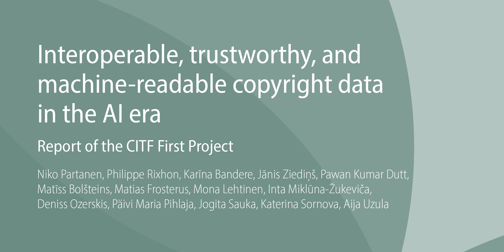

# Policy context and problem map {#sec-policy-context}

The European music ecosystem has undergone disruptive transformations in recent decades. In the 2010s, the arrival of agentic AI in streaming platforms radically reconfigured distribution and consumption. These systems centralised global sales, expanding the commercially available repertoire in a typical EU country from roughly 100,000 titles to over 100 million titles competing for attention. At the same time, the average transaction value collapsed from around €18 (in current prices) to less than €0.005. This shock hollowed out much of the traditional infrastructure — record stores, radios, and music television — and shifted value capture toward data-driven platforms able to control access through recommender algorithms.

In the 2020s, the rise of generative AI further exacerbates this situation. Large-scale models can mass-produce new compositions and recordings, often imitating or plagiarising patterns of human creators. This inflates supply, undermines the position of professional authors and performers, and aggravates existing problems of remuneration and discoverability.[^context-1]

[^context-1]: *Music Ecosystem 2025: Study on the Music Ecosystem* [@music_ecossytem_2025]; it frames the sector as an adaptive, networked ecosystem, highlights AI’s ability to disrupt on pp. 6–7, and mentions it as an opportunity particularly on p. 23. *Feasibility Study for the Establishment of a European Music Observatory* [@emo_feasibility_2020]; stresses the fragmented, scarce, and poorly harmonised nature of music data (pp. 9–10), the need for cooperation with rights organisations, statistical agencies, and industry stakeholders (p. 61), and introduces CEEMID as a best practice (pp. 147–148). CEEMID emerged from Budapest, Bratislava, and Zagreb as an early effort to address data poverty in Eastern EU Member States.

EU-level studies and policy frameworks have recognised these dynamics and increasingly frame them as systemic challenges. The *Feasibility Study for the Establishment of a European Music Observatory* diagnosed the fragmented, scarce, and poorly harmonised nature of music data collection across Member States, calling it the fundamental reason for an EU-level observatory. The *Music Ecosystem 2025 study* reframes the sector as an interconnected ecosystem, where platformisation, market consolidation, and emerging technologies like AI interact with broader societal challenges such as precarity, gender inequality, and sustainability. The European Parliament, in its *Resolution on cultural diversity and the conditions for authors in the European music streaming market*, echoed these concerns with explicit calls for reform.[^context-2]

[^context-2]: *European Parliament Resolution on cultural diversity and the conditions for authors in the European music streaming market* [@ep_resolution_music_streaming_2024]; it recognises streaming as the dominant global revenue source while leaving many authors with very low income (recitals F–H), stresses accurate metadata allocation at the time of creation using identifiers ISWC, ISRC, ISNI, IPI, and IPN (recital R, and 9.), highlights the lack of quality data to properly identify authors, performers, and rights holders (recital L), and warns that AI-generated tracks are flooding streaming platforms, aggravating discoverability and remuneration imbalances (recital O).

A third major contribution to this landscape is the 2025 *CITF First Project Report*, coordinated by the National Libraries of Finland and Latvia. CITF identifies open identifiers, machine-readable rights metadata, and national libraries as core components of a future copyright infrastructure. It introduces a three-layer model (foundational, semantic, technical) and provides lifecycle analysis of protected works in the AI era. Its findings complement the *Music Ecosystem 2025* and *EMO feasibility* studies by foregrounding the role of cultural heritage institutions and the need for trustworthy, interoperable copyright registries[^context-3].

[^context-3]: *Interoperable, trustworthy, and machine-readable copyright data in the AI era. Report of the CITF First Project* [@citf_2025]

Our policy brief positions itself within this landscape. It aims to support and extend the Music Moves Europe framework by highlighting six crucial dimensions:

1.  **Practical solutions**, grounded in dialogue between research and industry, and inspired by concrete experiences with open, federated data-sharing approaches.
2.  **Potential pitfalls** where well-meaning initiatives may clash with legacy systems, existing business practices, or contradictions in legislation.
3.  **Legal and operational conflicts**, such as the tension between GDPR’s data protection regime and the Berne Convention’s requirement of author attribution.
4.  **Cooperation and workflow sharing**, recognising that no single actor can bear the full burden of metadata documentation.
5.  **Technology**, including automation, entity recognition, reconciliation, and persistent identifiers.
6.  **AI adaptation and cooperative infrastructures**, since most stakeholders cannot attract or retain scarce AI expertise.

By foregrounding these issues, the brief complements the calls of the *Music Ecosystem 2025 study* and the *European Music Observatory feasibility study*, while remaining attentive to the practical challenges of implementation across Europe’s diverse music and cultural landscapes.

## Three structural pressures

Three structural pressures frame today’s metadata challenges:

1.  **Extreme efficiency pressure.** Music is now monetised in micro-transactions worth a fraction of a cent. Each metadata mistake means lost royalties, while big-tech platforms enjoy economies of scale that self-releasing artists, small labels, and national CMOs cannot match. National libraries in many countries already maintain massive copyright-protected collections and identifier systems, which could be cross-utilised with CMOs.

2.  **AI-driven disruption.** Agentic AI in streaming platforms has already displaced much of the traditional retail and promotion infrastructure. Both pre-deployment and post-deployment of AI affect reproduction, distribution, and attribution rights. Generative AI risks flooding platforms with derivative works and further destabilising discoverability and revenues. Yet AI tools could also support documentation and reconciliation — if governance frameworks can enable them.

3.  **Governance and incentive conflicts.** Identifiers such as ISWC, ISRC, ISNI, and IPN are essential for attribution and royalty distribution, but are maintained under costly, largely private regimes. Public policy increasingly demands more open metadata, but sustaining investment in these registers remains a challenge. Opt-out rights in AI training and the need for harmonised opt-out registries[^context-4], further complicate governance and incentive structures.

[^context-4]: As emphasised by CITF on pp. 17, 23–24 [@citf_2025, p17, pp. 23-25].

These pressures mean that improving metadata is not only a matter of technical interoperability. It is also a question of economic sustainability, legal coherence, and cultural policy.

## National and European pilots as anchors {#sec-anchors}

The analytical conclusions of the *Study on copyright and new technologies* subsequently informed further work at Member State and European levels[^context-5], including the establishment of the **Copyright Infrastructure Task Force** (**CITF**). The first CITF project report translates the study’s findings into a set of concrete infrastructure-oriented requirements, focusing on interoperable identifiers, standardised metadata schemas, and governance arrangements capable of supporting copyright-relevant data in the digital and AI era[^context-6].

[^context-5]: *Study on copyright and new technologies: copyright data management and artificial intelligence* (SMART 2019/0038) [@study_on_copyright_new_technologies_2022]

[^context-6]: *Interoperable, Trustworthy, and Machine-Readable Copyright Data in the AI Era: Report of the CITF First Project*[@citf_2025]

In this sense, the CITF process represents a continuation and operationalisation of earlier Commission-initiated analysis rather than a departure from it. The national and European pilots discussed below should be understood within this broader policy trajectory, as practical efforts to test, implement, and refine the types of solutions identified through these preceding analytical and consultative processes.

Several of the implementation pilots referenced in this Green Paper were conducted within formal policy cooperation frameworks rather than as isolated technical experiments. In the Slovak Republic, this work was guided by a *Memorandum of Understanding concluded between the Ministry of Culture of the Slovak Republic and members of the OpenMusE consortium*[^context-7]. The Memorandum established a framework for the reuse of open policy analysis outputs in cultural and creative sector policymaking and explicitly supported transparent, evidence-based experimentation with data governance and metadata infrastructures.

[^context-7]: *Memorandum o porozumení o využití výsledkov analýz otvorených politík v kontexte slovenského kultúrneho a kreatívneho priemyslu a sektorových verejných politík v spolupráci s konzorciom pre výskum a inovácie s názvom OpenMuse.* \[Memorandum of Understanding on utilizing the Open Policy Analysis results of the OpenMuse Research and Innovation Consortium in the context of Slovak cultural and creative industries and sectors' public policies\][@open_music_europe_sk_mou_2023]

This institutional context is significant because it situates the Slovak pilot activities, its replication in Hungary and in the Baltic region within existing public policy processes and legal competences, involving national authorities, collective management organisations, universities, and memory institutions. As a result, the *Open Music Observatory* (pan-European central module, available at <https://openmusicobservatory.eu/>), its national federated *Slovak Comprehensive Music Database* (available at [https://hudobnadatabaza.sk/](https://hudobnadatabaza.sk/en/photos/faceted-search/table?page=0)), the national federated *Hungarian Music Database*, and the music module of the sub-national *Finno-Ugric Data Sharing Space* (available at [https://finnougric.net/](https://finnougric.net/en/)) should be seen not only as a technical pilot, but as an example of policy-embedded implementation aligned with both national cultural policy objectives and emerging European discussions on copyright infrastructure.

From the outset, we draw on concrete pilots that illustrate both the problems and possible solutions. Two of them — the Slovak Comprehensive Music Database (SKCMDb) and Unlabel — will recur throughout this paper as reference points. Together, they anchor the three thematic chapters: curation (@sec-curation), the proposed European Music Observatory on the basis of the *Open Music Observatory* (@sec-observatory), and AI (@sec-ai).

### The Slovak Comprehensive Music Database (SKCMDb)

SKCMDb is our national pilot for federated metadata governance. It links together data from collective management (SOZA), national and city libraries, and archives, while ensuring that works can also be discovered in the digital environments where people actually listen: Spotify, YouTube, Apple Classical, and others.

A further layer reconciles this metadata with the Slovak Statistical Office via a *Satellite Business Register*, so that cultural production is visible in official economic data.

The **SKCMDb** is anchored in the **Memorandum of Understanding** signed between collective management organisations (SOZA, SLOVGRAM), cultural institutions (Hudobné centrum, Slovak National Library, Hudobný fond), and Reprex. SKCMDb’s strategy of combining copyright data (SOZA), neighbouring rights (SLOVGRAM), and national library authority control directly reflects CITF’s observation that national libraries must be integrated into copyright infrastructure, not treated as purely heritage institutions.

This MoU formalises a federated governance model where:

-   **Attribution** (names of authors, performers, composers) is preserved as legally mandatory under copyright law.

-   **Privacy** is safeguarded by layered access: public data (names, works, identifiers) circulate broadly, while sensitive data (e.g., addresses, birth dates) remain restricted.

-   **Interoperability** is achieved by aligning with VIAF, ISNI, ISWC, ISRC, and Europeana.

As such, the Memorandum provides the *legal and institutional foundation* for SKCMDb, turning a technical pilot into a national dataspace aligned with the EU Data Strategy.

::: infobox
**The SKCMDb in action**

The chart illustrates the biography and works of Slovak composer **Iris Szeghy** as an example:

[{fig-align="center"}](https://zenodo.org/records/16634558)

-   **Left side:** reconciliation of her works across SOZA, the Slovak National Library, the Bratislava City Library, and archives.
-   **Right side:** linking to listening platforms (Spotify, YouTube, Apple Classical).
-   **Bottom:** reconciliation with the Slovak Statistical Office via the Satellite Business Register.

SKCMDb thus acts as a bridge between cultural memory institutions, rights management, digital distribution, and public policy.
:::

SKCMDb provides a pragmatic response to fragmentation and duplication. It anchors the discussion of **preventive metadata strategies** in @sec-curation.

This challenge is not unique to Slovakia. A recent Horizon Europe policy brief has highlighted how **inadequate metadata infrastructures** and **fragmented European initiatives** risk leaving the field open to dominance by extra-European players (for example, the US Mechanical Licensing Collective).[^context-8]

[^context-8]: See *Policy Brief 1: Music Metadata Mainstreaming and EU Law* [@ivir_metadata_policy_2024] (Deliverable D5.6, OpenMusE project). That brief emphasises that without a European metadata infrastructure, EU repertoires may remain underexploited and culturally invisible, while foreign platforms consolidate hegemony. The present Green Paper extends on this line of argument by focusing on lifecycle-based interoperability and federated observatories as safeguards for European sovereignty.The Policy Brief 1 Annex references the Slovak Listen Local / SKCMDb project as a national pilot, underlining its relevance for EU-level policy design. The *Green Paper* complements this by situating the MoU as a replicable governance framework for federated metadata spaces.

### Unlabel

If SKCMDb focuses on building preventive infrastructures, **Unlabel** demonstrates how to repair the past. It is a collaborative pipeline connecting archives, libraries, collective rights organisations, and distributors to bring under-documented repertoires into the global digital supply chain.

A striking example is the case of **Hilda Griva**, a bilingual Livonian–Estonian artist active in the interwar Finno-Ugric revival. Her recordings were rediscovered in the Latvian Archives of Folklore but lacked the metadata required for circulation. Through Unlabel, we translated and enriched her records, reconciled them with international authorities, and extended them with **DDEX catalogue transfer metadata**, enabling release via Spotify, YouTube, and Apple Music.

Our multi-layer model (DDEX, DCTERMS, RiC patterns, and rights metadata) aligns with CITF’s three-layer structure: DCTERMS in the foundational layer, RiC and DDEX conceptual mappings in the semantic layer, and DDEX catalogue-transfer formats in the technical layer.

::: callout-note
**Infobox: Unlabel and Hilda Griva**

-   Metadata repair began with archival records in the Latvian Archives of Folklore.
-   Records were translated, enriched, and reconciled with Wikidata, MusicBrainz, and VIAF.
-   DDEX-compliant catalogue transfer metadata enabled digital distribution.
-   The enriched catalogue allowed Hilda Griva’s recordings to be released and discovered globally.
:::

Unlabel demonstrates how public heritage institutions and private distributors can cooperate through shared standards. It anchors both the **curative AI approaches** in @sec-ai and the **observatory perspective** in @sec-observatory.

## Quest for efficiency

Technological progress, digitisation, automation, and now AI have transformed the music industry more dramatically than most sectors. After the collapse of the CD era under peer-to-peer piracy, a newly configured recording industry emerged around global platforms. Traditional retail and wholesale jobs largely disappeared, replaced by streaming platforms such as YouTube, Apple Music, and Spotify.

This shift coincided with a structural **devaluation of music**. The licensed streaming model never recovered the real revenues of the pre-collapse recording market, and from this diminished base, platforms take a significant share. Where a CD sale once brought around €10–18 in today’s terms, the unit of account in streaming is a fraction of a cent — typically \$0.003–0.005 per play.

To replace the economic weight of a single album sale, a rightsholder must now process and account for roughly 4,000 successful streams. This is not merely an economic shift, but an **administrative revolution**. The documentation efficiency needed to handle millions of micro-transactions profitably is far higher than in the pre-streaming era.

Streaming platforms are genuine big-data companies. Alphabet’s YouTube, Apple, and Spotify operate at a scale where billions of transactions and hundreds of millions of assets can be managed by autonomous agents and recommender engines. But the typical rightsholder — a self-releasing artist, an independent label, or even a national collective rights agency — works at a scale where each metadata mistake means lost royalties, and where IT or documentation specialists are often absent altogether. This asymmetry is so stark that even major CMOs rely on shared infrastructures like the digital services of "Mint" to manage repertoire at scale.

Music, then, is now sold in **extremely low-value transactions mediated by autonomous agents**. This reality enforces a very strong pressure on the entire ecosystem to improve data interoperability and metadata quality.

As the CITF report emphasises, AI introduces legal lifecycle pressures: both the training and deployment of AI systems may trigger reproduction, distribution, adaptation, and communication-to-the-public rights. This amplifies the economic consequences of metadata fragmentation: missing or inconsistent identifiers now propagate across algorithmic pipelines as well as financial ones[^context-9].

[^context-9]: See [@citf_2025, p31].

By contrast, in most industries administrative overhead is modest:

-   Retail/distribution: \~2–5% of net sales
-   Manufacturing: \~3–7%
-   Professional services: 10–15% (because administration blurs into the product)
-   OECD/EU cross-industry averages: 3–8% of turnover

In “normal” industries, then, €50 of administrative cost is justified on €1000 of revenue. By comparison, in the recorded music industry, achieving that same 5% efficiency requires delivering faultlessly some 200,000 streaming transactions. This is a **very tall order** for a sector dominated by micro-enterprises and small independents without dedicated IT or metadata teams.

The pressure for efficiency is not only present on the production side of the music business. In the **non-profit sector**, digitisation has profoundly transformed the workflows of archives, libraries, and heritage institutions as well. Streaming has reduced demand for physical collections, forcing libraries to reframe their role around digitisation, knowledge organisation, and community functions rather than lending CDs or scores. New spaces like creative studios and digital repositories are expected, but funding is limited, so efficiency is critical. At the same time, the vast amount of born-digital assets — and now the endless output of generative AI systems — creates a puzzle for archives that remains unsolved today.[^context-10]

[^context-10]: See for example the Katona József Library’s adaptive strategies [@virag_2024]. Archives, on the other hand, face a problem that instead of receiving records on paper, they are becoming gigantic data silos in the age of born-digital documents. They are being transformed into data through digitisation and born-digital records, face volumes too large for manual processing. This pressures traditional archival concepts such as provenance, original order, fixity, and authenticity [@colavizza_2022].

::: infobox
**Metadata as provenance**

In today’s music ecosystem, almost every asset is born digital. A modern composer’s score is produced in notation software; a performer’s recording originates as a digital file; even printing, distribution, and promotion leave their own digital traces. From the very start, each musical work and each recording comes with a dense **digital fingerprint**.

As these works move through their lifecycle — composition, registration, performance, recording, distribution, preservation — they accumulate **provenance statements**: *“X composed this,” “Y registered that,” “Z archived this file.”* Taken together, these traces form a chain of knowledge about the history of the work. Unlike in earlier centuries, this history is now almost continuously captured, though often fragmented or messy — the “shadows” that Karabinos has described.

{fig-align="center"}

Metadata is “data about data.” But in practice, what counts as data or metadata is relative: a duration may be descriptive for one actor, identifying for another, and algorithmic input for a third. This distributed record of provenance resembles a **chain of statements**, some verifiable, some contradictory, some lost in the shadows. The challenge is not to build a single immutable blockchain, but to make the distributed record reliable, reusable, and interoperable.

As shown in @sec-anchors, pilots like **SKCMDb** and **Unlabel** provide two complementary responses: preventive governance of metadata at creation (@sec-curation), and curative repair of legacy repertoires (@sec-ai; @sec-observatory).
:::

## Potential solutions

The challenges described above call for coordinated responses that combine technical, organisational, regulatory, and governance measures. This policy brief develops them in detail across three thematic chapters — **curation** (@sec-curation), the **observatory** (@sec-observatory), and **AI** (@sec-ai). Here we present an integrated overview of the solution families.

1.  **Reducing redundancy and improving efficiency.**\
    Shared registries and federated pipelines ensure that data is captured once and reused many times. The Slovak Comprehensive Music Database (SKCMDb, @sec-curation) demonstrates how libraries, rights societies, and archives can align their catalogues while retaining institutional autonomy.

2.  **Reconciling attribution and privacy.**\
    Metadata must balance GDPR requirements with author attribution duties under copyright law. Identifier pilots such as **PRS Nexus** and **Teosto ISNI** show preventive strategies at the point of creation, while SKCMDb offers curative repair of legacy repertoires.

3.  **Pragmatic metadata alignment.**\
    Instead of one universal ontology, modular and pattern-based approaches allow interoperability across domains. Initiatives such as **Polifonia**, **MusicBase**, and the **Unlabel** pipeline provide practical bridges between archival, library, and distribution metadata (@sec-curation, @sec-observatory).

4.  **Cross-sector observatories and data spaces.**\
    The **Open Music Observatory** (@sec-observatory) applies the European Interoperability Framework and 8-Star FAIR model to connect rights societies, libraries, archives, and statistical offices. Data sharing spaces provide governance, semantic, and technical layers that make public and private infrastructures interoperable.

5.  **Curative strategies with AI.**\
    Many repertoires remain invisible due to incomplete or inconsistent documentation. **Curative AI** (@sec-ai) can support enrichment, translation, duplicate detection, and plagiarism monitoring, extending the principles of Unlabel to broader repertoires.

6.  **Bridges to public infrastructures.**\
    Europe already invests in the **European Open Science Cloud (EOSC)**, the **European Collaborative Cloud for Cultural Heritage (ECCCH)**, and **Europeana**. These infrastructures should be aligned with the music sector to support both cultural preservation and competitive participation in digital markets.

7.  **Shared AI services.**\
    Micro-enterprises, NGOs, and CMOs cannot build in-house AI capacity. Cooperative AI utilities — reconciliation-as-a-service, metadata repair pipelines, watchlists for duplicates — can be pooled under shared governance (@sec-ai).

This integrated roadmap frames the more detailed analysis and recommendations in the chapters that follow.

The analysis and examples presented in this Green Paper are informed by a set of closely related analytical, legal, and implementation documents, including:

-   *Study on copyright and new technologies: copyright data management and artificial intelligence*

-   *Interoperable, trustworthy, and machine-readable copyright data in the AI era* (CITF First Project Report)

-   Memorandum of Understanding on the reuse of Open Policy Analysis outputs in Slovak cultural policy

-   OpenMusE technical deliverables documenting implemented data infrastructures and workflows

These materials provide additional detail on the legal, technical, and institutional assumptions underlying the policy synthesis offered here.

::: callout-note
#### CITF {.unnumbered}

[{fig-align="center"}](https://julkaisut.valtioneuvosto.fi/server/api/core/bitstreams/3fb3f9ed-e93a-48fb-92e8-93c61a999e48/content)

The CITF report, based on the *Study on copyright and new technologies: copyright data management and artificial intelligence*, defines a structured approach to future copyright infrastructures through three layers (foundational, semantic, technical). The solution pathways proposed in this Green Paper can be mapped onto these layers: identifier governance corresponds to the foundational layer; pragmatic ontology patterns map to the semantic layer; and federated pipelines align with the technical layer.
:::
