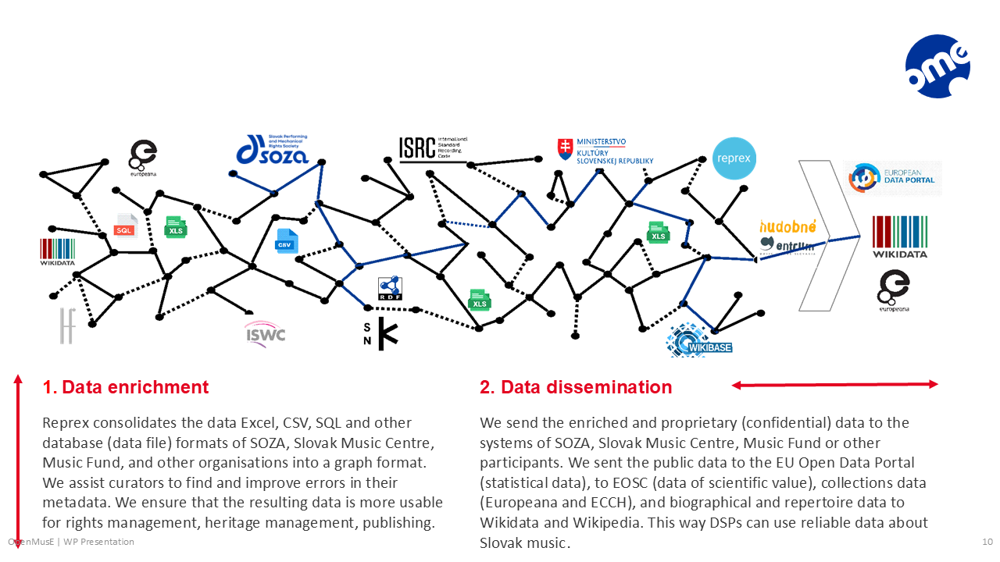

# Fixing Music Data at the Source {#sec-curation}

[{fig-align="center"}](https://doi.org/10.6084/m9.figshare.30073888.v1)

## Discussion

### Structural fragmentation of data and value flows

In the music ecosystem, data is not simply decentralised by design but *structurally scattered*. Rights metadata is maintained by hundreds of collective management organisations and publishers, while recordings and distribution data are spread across labels, distributors, and global platforms. Libraries and archives manage their own authority files, often linked only imperfectly to international standards such as ISNI, VIAF, or ISBN. Independent projects and community-driven infrastructures, such as *Wikidata* and Wikibase, add yet another layer of documentation. CITF identifies similar fragmentation across the wider copyright infrastructure. This fragmentation reflects not only technical heterogeneity but also legal constraints, economic incentives, and institutional divisions across the sector. It notes that rights metadata, identifiers, and RMI are distributed across many actors with differing mandates and data models, and that inconsistent identifier governance contributes to systemic opacity and recurring reconciliation costs [@citf_2025, pp10–18; p23]. To understand how these problems can be addressed, it is useful to distinguish three complementary layers of copyright infrastructure.

::: callout-note
#### Three layers of copyright infrastructure

For analytical clarity, copyright infrastructure can be understood as operating across three complementary layers. The first of these is the primary focus of the EU copyright infrastructure study and the work of the *Copyright Infrastructure Task Force (CITF)*, while the latter two extend this perspective by incorporating insights from the *European Interoperability Framework (EIF)* and practical infrastructure design.

- **Semantic and technical foundations:** identifiers, metadata schemas, and machine-readable rights information. This layer forms the core of the EU copyright infrastructure study and the work of the *Copyright Infrastructure Task Force (CITF)*.

- **Operational workflows:** the lifecycle processes through which works, recordings, creators, and rights information are registered, updated, reconciled, and validated across institutions.

- **Organisational and legal interoperability:** the governance arrangements, contractual frameworks, and institutional cooperation that allow these workflows to operate across a fragmented ecosystem. These dimensions correspond to the organisational and legal layers of the *European Interoperability Framework (EIF)* and are necessary to translate semantic interoperability into a functioning infrastructure that creates value for the music ecosystem.

Improvements in the semantic layer alone are therefore insufficient; sustainable solutions must also address the operational workflows and governance structures through which music data circulates in practice. These governance and legal dimensions have been further elaborated in recent scholarship building on the OpenMusE framework, which shows that the persistent absence of authoritative registries reflects institutional constraints and incentive misalignments rather than purely technical limitations [@bodo_political_economy_2026].
:::

The present Green Paper does not propose a new copyright infrastructure architecture. The conceptual foundations of such infrastructures have been analysed in the EU copyright infrastructure study and in the work of the *Copyright Infrastructure Task Force (CITF)*. Our contribution focuses on implementation in practice within the music sector. The *Open Music Observatory* and its partner infrastructures are therefore being developed as a domain-specific implementation aligned with the CITF framework. In ongoing discussions with CITF partners, we are preparing to develop these pilots further as a **music-sector use case** within the broader European copyright infrastructure landscape, demonstrating how interoperable workflows, federated registries, and data sharing spaces can operate in practice across a fragmented ecosystem.

This fragmentation is not an anomaly but a structural condition of the sector, shaped by the legal, economic, and organisational design of copyright and cultural data systems: tens of thousands of micro-enterprises and NGOs in Europe each manage slivers of data about works, recordings, or performances. As the *Feasibility Study for a European Music Observatory* underlined, *“the fragmented, scarce and poorly harmonised nature of the data collection landscape in the field of music has led to calls … for a European Music Observatory”* [@emo_feasibility_2020, p9]. Likewise, the *Music Ecosystem 2025* study frames the sector as an ecosystem, where knowledge and value are distributed across many small actors, each with partial perspectives [@music_ecossytem_2025, pp6–7].

The institutional anchoring of a future *European Music Observatory* is therefore a critical question. In our own feasibility planning we reviewed approximately 80 functional and discontinued data observatories, understood here as permanent institutions for ongoing data collection and dissemination. The majority in Europe were initiated by the European Commission and maintained under various public–private partnership (PPP) formats, rather than as heavy agencies or autonomous bodies.

In this sense, Europeana offers a useful analogy: it coordinates metadata and access across hundreds of institutions without requiring the scale or mandate of entities such as the EUIPO or the European Audiovisual Observatory. In our interim report deliverable we suggested a similar creation path like that of the Europeana Foundation and its various layers of stakeholders [@omo_2024].

From this perspective, we believe the Observatory should follow the lighter, federated PPP model: anchored by the Commission to ensure continuity and legitimacy, but implemented through a distributed network of partners across the public, private, and research domains. This strikes a balance between stability and flexibility, while staying true to the cooperative, federated spirit that underpins our proposal. The CITF report reaches a similar conclusion: copyright data cannot be centralised at European scale and must instead be organised through layered, federated arrangements where national libraries, rights organisations, and cultural institutions each retain their roles while interoperating through open standards[^curation-1].

[^curation-1]: See [@citf_2025, pp13–18].

Recognising this scattered landscape is essential. It also implies that metadata systems cannot rely on static records alone, but must support continuous updating, reconciliation, and reclassification over time. This lifecycle perspective is essential for handling legacy data, resolving identifier inconsistencies, and supporting dynamic rights status across the ecosystem. It explains why reconciliation overheads are high, why identifier coverage is incomplete, and why “capture once, reuse many” pipelines are necessary. It also provides the foundation for the next chapter: explaining why *attempts at centralisation are futile* in such an ecosystem, and why sustainable solutions must build on federation and interoperability.

Yet fragmentation is not only institutional — it is also economic. Classic value-chain analyses describe three main income streams — live performance, publishing, and recordings — that still structure industry practice.[^curation-2] Digital distribution has blurred these categories without unifying the underlying infrastructures. Each handover in the lifecycle — authoring, performing, recording, distributing, streaming — generates both a financial flow and a data event. Business flows are continuous, but metadata flows are siloed. ISWCs do not connect seamlessly with ISRCs; ISRCs are rarely linked to ISNIs or VIAF authority files. The result is redundancy, inconsistency, and costly reconciliation work. The core problem is therefore not the absence of metadata standards alone, but the absence of interoperable operational workflows. Without such workflows, even well-defined identifiers and schemas cannot prevent fragmentation, inconsistency, and loss of economic value. This interpretation builds on the findings of *Open Music Registers* (Deliverable D1.4, [@open_music_registers_2025]), which highlights fragmentation and interoperability gaps but leaves their operational implications under-specified.

[^curation-2]: This value-chain framing originates in Hull’s *The Music Business and Recording Industry* [@hull_music_2011] and Leurdijk et al.’s *Statistical, Ecosystem and Competitiveness Analysis of the Media and Content Industries* [@leurdijk_statistical_2012], and was adapted in subsequent CEEMID reports [@antal_slovenskom_hudobnom_2019_en, @antal_ceereport_2020]. The CEEMID work was recognised as a best practice in the *Feasibility Study for a European Music Observatory* [@emo_feasibility_2020], which highlighted its role in linking fragmented data sources into a coherent economic analysis.

[{fig-align="center"}](https://doi.org/10.6084/m9.figshare.19174310.v1)

To address these challenges, we have adopted the value chain model of the European music ecosystem[^curation-3]. This approach is especially useful for designing data collection that measures cash flows, gross value added, and zero-price uses of music. It highlights both typical price points (e.g. averages or medians) and the interlocking metadata flows that accompany transactions. For policymakers, the model provides a way to trace how consumption — such as a consumer buying a recording through a shop, distributor, and label — translates into revenues for performers and composers. For data governance, it illustrates why capturing the metadata trail of cash flows is essential not only for valuation and cultural statistics but also for building an audit trail for fair remuneration. In the context of this policy brief, the value chain perspective therefore complements the current ecosystem analysis by clarifying which agents must be accounted for in conceptual models of data interoperability.

[^curation-3]: The standard American/global analytical breakup of the music industry is described in [@hull_music_2011], its European adaptation in [@leurdijk_statistical_music_2012]; our more detailed Central European breakdown and the figure are described in [@antal_ceereport_2020; @antal_mce_2021]. For reuse of the figure see [@antal_music_industry_value_chain_figure].

### Cost barriers in documentation and claims {#sec-econ-curation}

For small publishers, labels, and self-publishing artists, the economics of documentation create a vicious circle. Most European repertoire is released by micro-enterprises that cannot afford dedicated staff for accounting or metadata. They save costs by using spreadsheets or freelance accountants, but this is efficient only in total terms — on a per-unit basis, the costs of documentation and claims are very high. Poor metadata then leads to poor discoverability on platforms, which in turn depresses revenues and leaves even less money for proper documentation.

Capital investments (CAPEX) present the same dilemma. Enterprise IT systems or royalty accounting platforms may be cost-effective for catalogues with millions of assets, but are unsustainable for catalogues of a few thousand. As a result, many small actors are locked into obsolete systems that are costly to maintain but too expensive to replace.

This structural imbalance means that metadata costs are proportionally higher for small entities than for large ones. Without a way to share infrastructure or reduce per-unit costs, small rightsholders remain stuck: they cannot spend more on documentation and claims than their total royalty income allows, yet under-documentation ensures that much of their income is never collected.

These cost barriers are not isolated bookkeeping problems — they are structural features of music data curation. How a data sharing space can provide scale effects and relieve these constraints is discussed in @sec-dss-solution.

### Why one grand collection model will not work {#sec-no-universal-ontology}

Every actor in music — a library, an archive, a label, or a rights society — has its own way of defining what counts as music, what is a sound recording, how to collect such things, and what belongs in a “collection.” These logics are shaped by their missions, legal obligations, and incentives. A library may collect under a national deposit law, a collective management organisation must register what its members submit, and a distributor includes whatever its clients release. None of these logics are wrong, but they are different. This is why attempts to force everything into one universal collection model have failed.

In abstract terms, there is no single “conceptualisation” of the world that can fit a rights management organisation, a library, and a music archive equally well. On a very abstract level, the same lesson was drawn in mathematics and philosophy: Gödel showed that no formal system can capture all truths within itself, and Quine argued that reference is always relative to a conceptual scheme. In computer and information science, we know this as the impossibility of a universal ontology that could serve all databases.[^curation-4] These limits are well understood, but recognising them is not an excuse for inaction. It means we should work pragmatically: accept that multiple logics exist, and focus on making them interoperable where possible.

[^curation-4]: As information science shows, a *collection* is not a mathematical set but a socially and institutionally constructed grouping, shaped by curatorial or organisational logics. Attempts to create one “mega-ontology” for music metadata have consistently failed, because the sector is too heterogeneous — collective management organisations, libraries, archives, platforms, and distributors operate under different standards and governance models. At a more philosophical level, Quine reminds us that any ontology is relative to its conceptual scheme, and there is no absolute description of the world that can serve all purposes equally ([@quine_1968]). Gödel’s incompleteness results, likewise, show the inherent limits of formal systems, underscoring why computer science and database theory recognise that no single universal ontology can capture all possible cases. The CITF report likewise rejects any attempt to impose a single universal schema. Instead, it argues for a semantic interoperability layer that allows heterogeneous systems to exchange meaning without erasing institutional differences.\[\^citf-patterns\].

::: callout-note
#### Why collections differ in databases {.unnumbered}

- **Libraries** collect under *legal deposit rules*: every book or score published in a country must be included, regardless of popularity.\
- **Archives** follow *provenance*: they keep what an organisation or individual produced, not necessarily what is “important.”\
- **Collective management organisations (CMOs)** must register *only what their members submit* — the collection reflects contracts and repertoire, not cultural completeness.\
- **Distributors** take what their clients release: the “collection” is shaped by market demand and contracts.

Each of these logics is valid, but none can be reduced to the others. This is why a single “grand ontology” for all collections is not achievable. The pragmatic task is to connect them through lightweight, modular patterns that allow data to flow across boundaries while respecting institutional differences.
:::

### Legacy metadata {#sec-legacy-metadata}

The European Parliament has emphasised that accurate and standardised metadata is essential for ensuring fair remuneration and proper attribution in the music streaming market. It calls for identifiers such as ISWC, ISRC, ISNI, IPI, and IPN to be allocated at the moment of creation, and warns that the flood of AI-generated tracks will worsen discoverability and revenue imbalances if metadata remains incomplete or inconsistent.[^curation-5]

[^curation-5]: European Parliament resolution of 17 January 2024 on cultural diversity and the conditions for authors in the European music streaming market, recital 32 [@ep_resolution_music_streaming_2024].

In practice, achieving this goal has proven very difficult. The registers that underpin music metadata are privately governed, require continuous investment, and cannot simply be rebuilt from scratch. Hundreds of millions of assets are already circulating, and billions of transactions are handled annually on the basis of this legacy infrastructure. Even the term *metadata* is ambiguous: in libraries and information systems it refers to descriptive information (title, genre, provenance), whereas in the music industry it often refers more narrowly to administrative identifiers used for royalty distribution.

::: callout-note
#### Forward-looking identifier pilots: PRS Nexus and Teosto ISNI

Two recent initiatives show how the industry is moving towards *better identifier coverage at source*:

- **PRS for Music – Nexus.** A new portal linking works (ISWC) and recordings (ISRC) at the moment of release. It already covers nearly 3 million works and offers APIs for rights-holders and DSPs [@prsformusic_nexus_2023; @wipo_nexus_2023]. By embedding ISWC allocation into distribution workflows, Nexus aims to accelerate royalty payments and reduce reconciliation delays that often last months or years.

- **Teosto – ISNI for authors.** The Finnish CMO Teosto now assigns ISNIs to its members, giving authors and composers persistent identifiers that interlink with VIAF, ORCID, and Wikidata [@teosto_isni_2024]. This connects music rights data with library and research infrastructures and strengthens international interoperability.

These projects simplify metadata at the point of creation and release, aligning with persistent identifier strategies in the research sector [@nwo_pid_strategy_2021]. But they mainly address *future repertoire*. The much larger challenge lies in the **hundreds of millions of legacy assets** already circulating without complete identifier links — a problem that requires complementary solutions, discussed later in this chapter.
:::

Together, ISRC (recordings), ISWC (works), and ISMN (printed music) form the backbone of music identification. In theory they provide global coverage, but in practice they remain fragmented: many recordings never receive identifiers, links between identifiers are often missing, and uptake is uneven across registries. This fragility makes the European Parliament’s ambitions difficult to realise without new layers of interoperability, observability, and shared responsibility. The sheer growth in repertoire makes this gap impossible to close with manual workflows: by 2024, more music was released in a single day than in the entire year of 1989 [@abing_more_music_2024][^curation-6]. This scale of legacy under-documentation cannot realistically be resolved with manual workflows alone — it points directly to the need for **curative AI** approaches, which we return to in @sec-ai-policy.

[^curation-6]: The *International Standard Recording Code* (ISRC) was introduced in 1986 as a 12-character identifier for recordings (ISO 3901) and is managed operationally by IFPI [@iso_isrc_2019; @isrc_handbook_2021]. Persistent problems include retroactive assignment, inconsistent embedding, and weak interoperability with ISWC [@paskin_2006, p4]. The *International Standard Musical Work Code* (ISWC) identifies compositions and lyrics (ISO 15707), managed by CISAC through the ISWC Agency [@iso_iswc_2022]. Challenges include duplicate codes, mismatches with ISRC, and uneven adoption by CMOs [@paskin_2006, p7]. The *International Standard Music Number* (ISMN, ISO 10957) identifies printed music publications [@iso_ismn_2021]. It provides a bridge between bibliographic and rights-management practices, but remains underused in digital workflows. CITF also highlights the fragility of legacy rights metadata, noting that many identifiers lack persistent links, that national and sectoral registries follow incompatible governance models, and that historical gaps in RMI complicate both attribution and AI-related provenance. It stresses the need for repairable metadata chains capable of supporting lifecycle analysis and AI-era compliance [@citf_2025, pp12–18; pp28–33].

Although metadata repair is indispensable, metadata is never neutral. Without corrected identifiers, reconciled names, and enriched annotations, works remain invisible in royalty and discovery systems. However, just as heritage data spaces show how repairing metadata can restore visibility while also reinforcing institutional logics, in music ecosystems the same repair practices can unexpectedly increase exposure to generative AI. By making works more legible to agentic applications, enriched metadata improves attribution but also sharpens the ability of AI systems to imitate and substitute. This paradox is most acute for small-scale repertoires and independent artists, whose economic position mirrors the epistemic vulnerability of minority heritage collections.

CITF emphasises this duality. It notes that richer attribution and provenance metadata are essential for rights enforcement, yet these same signals can enhance the capacity of AI systems to generate derivative content. This makes trustworthy provenance, audit trails, and transparent RMI all the more important in AI-era infrastructures[^curation-7].

[^curation-7]: See [@citf_2025, pp20; p31; pp101–102].

::: callout-note
#### Case Study: Metadata Repair — Heritage and Repertoire

**Repairing heritage metadata**\
- In the *Finno-Ugric Data Sharing Space* we worked with the *Latvian Archive of Folklore* and regional museums to repair and enrich metadata around Livonian, Latvian, and Hungarian folk music.\
- In Hungary, together with the *House of Music*, we began repairing the lost documentation of recordings suppressed under Communist censorship. Here, repair is not only a matter of accuracy but also of restitution: without corrected metadata, these works remain locked behind outdated copyright classifications long after the state label monopoly has ended.\
- Original records in both contexts were shallow, monolingual, and shaped by institutional or censored taxonomies. By reconciling names, places, languages, and cultural terms, we enabled works to be rediscovered across Wikidata and Wikipedia.\
- These are extreme cases of damaged metadata (through censorship, Soviet-type copyright, or minority language non-standardisation). Yet similar problems affect the long tail of European music heritage and today’s independent or self-releasing artists.\
- As our forthcoming academic paper shows, this is not a neutral “clean-up”: choices about vocabularies and identifiers determine what communities can see of themselves. Repair here means **cultural repair** — restoring epistemic visibility to communities, legal heirs, and cultural stewards.

**Repairing repertoire metadata**\
- Through the *Unlabel* prototype, we apply similar practices to contemporary self-released music: enriching works with ISRC/ISWC codes, multilingual annotations, and library-standard metadata.\
- This makes previously “invisible” tracks legible to streaming platforms and collection societies, improving discoverability and royalty flows.\
- Again, repair is not neutral: the way identifiers and categories are assigned shapes how artists’ works are found, monetised, or sidelined.

**The paradox**\
- These cases illustrate that **metadata is never neutral**. Repair empowers artists and communities, but it also encodes assumptions and makes works more legible to agentic applications.\
- In heritage, institutional schemas may flatten local epistemologies; in the market, generative AI may exploit enriched metadata to imitate and substitute — a problem we will discuss in @sec-ai.\
- In both contexts, **metadata repair empowers and exposes** — visibility and risk are two sides of the same process, which makes metadata governance a **policy concern**, not a purely technical one.

**Our approach**\
- Our solution is to use decentralised systems like Wikidata and Wikibase together with strong ontological patterns.\
- Heavy-weight ontologies take up to a decade to develop, may introduce new biases through the non-neutral nature of metadata, and by the time they are created, they may not address new challenges — for example, providing guardrails against negative outcomes of agentic or generative AI.\
- As with the infrastructure in @sec-observatory, we aim for decentralisation already at the metadata-definition level. An **Open Music Observatory** will allow metadata to be managed through flexible, open processes that create definitions and establish equivalences to existing standards.
:::

### Named-entity resolution, attribution, and privacy {#sec-gdpr-curation}

Attribution is not optional in music: the names of authors, performers, and producers are structurally necessary for copyright, royalties, and cultural record-keeping. Yet under GDPR, these names count as personal data, creating a contradiction at the very foundations of metadata curation. What is mandatory under copyright law becomes a liability under data protection law. In practice, private actors face repeated balancing tests, inconsistent interpretations, and the risk of complaints even when attribution is legally required.

The CITF report explicitly identifies this contradiction. It notes that names and attribution data constitute rights-management information protected under Article 7 of the InfoSoc Directive, yet they are also personal data under GDPR. CITF therefore calls for trustworthy, machine-readable RMI governance that distinguishes public-interest attribution data from restricted personal information and supports layered access models[^curation-8].

[^curation-8]: See [@citf_2025, pp12–18; p84].

This contradiction drives up costs and discourages investment in better metadata. Small publishers and self-releasing artists already face disproportionately high OPEX (documentation, bookkeeping) and CAPEX (IT systems). Without affordable, legally secure ways to resolve named entities, their works perform badly on platforms and royalties are lost.

Policy communities in Europe recognise these issues. The **Big Data Value Association (BDVA)** has long argued that trust frameworks and governance pillars are essential for data sharing, while the **Federation Working Group** stresses that federation — not centralisation — is the only realistic model for connecting Europe’s fragmented data ecosystems [@bdva_position_2019; @bdva_discussion_paper_2023; @federation_wg_position_2023]. These principles apply equally in music. But given the sector’s extreme fragmentation and micro-enterprise structure, implementing them here is especially difficult.

How these structural problems can be addressed at systemic level is the subject of @sec-gdpr-observatory, where we show how data sharing spaces provide a way forward.

## Policy proposals {#sec-curation-policy-proposals}

[{fig-align="center"}](https://zenodo.org/records/16634558)

### Reducing redundancy {#sec-curation-redundancy}

The European Parliament has rightly highlighted that fragmented and unreliable metadata remains a major obstacle in the music sector. We agree with this diagnosis, but stress that the root cause lies partly in the need for backward compatibility with hundreds of millions of legacy assets, and in the costly redundancy of today’s practices: the same information must be repeatedly entered into separate systems such as ISNI, ISWC, ISRC, VIAF, or local authority files. This duplication creates errors, increases costs, and discourages accurate registration.

{fig-align="center"}

CITF frames this redundancy as a foundational problem of copyright infrastructure. Its proposed foundational layer centres on open, authoritative identifiers for agents and assets, issued by trusted institutions and supported by interoperable mappings[^curation-9].

[^curation-9]: Aligning workflows around these identifiers directly addresses the structural issues described in the report [@citf_2025, pp23–28; pp85–87].

Our policy solution is to support **redundancy-free registration** by aligning the workflows of those who already maintain authoritative data. Instead of duplicating efforts, registration steps can be coordinated once and reused many times. We demonstrate this approach with our *Open Music Registers* pilot: a federated infrastructure that interconnects persistent identifiers (ISWC, ISRC, ISNI, VIAF) and, where relevant, links them to business and statistical identifiers (e.g. OpenCorporates, NACE, ISCO). This allows music creators and organisations to benefit from smoother workflows, while downstream users gain more reliable data for royalty distribution, cultural visibility, and AI-driven discovery.

The *Open Music Registers* deliberately avoid centralisation. Each registrar — collective management organisations, libraries, archives, or statistical offices — retains ownership of its data but contributes to a shared semantic framework.[^curation-10] By connecting rather than merging registers, redundancy is reduced while subsidiarity, accountability, and trust are safeguarded across public and private actors. This distributed model directly answers European Parliament’s call for metadata systems that are reliable, inclusive, and supportive of creators.[^curation-11]

[^curation-10]: Technically, this corresponds to a *provenance-oriented modelling* approach such as the W3C **PROV-O** standard [@prov_model_2013; @prov_o_2013], which connects actors, activities, and entities in chains of attribution (“a composer authors a work, a performer interprets it, a producer records it…”). These chains can be expressed in the layered terms of the *European Interoperability Framework* (EIF), ensuring legal, organisational, semantic, and technical interoperability [@eif_2017].

[^curation-11]: The *Data Spaces Support Centre (DSSC)* Blueprint v2.0 underlines that identifiers and rulebooks are the foundation of any common European data space [@dssc_blueprint_intro_2025]. In the music sector, however, attribution identifiers themselves are caught in the GDPR contradiction (see @sec-gdpr-curation), which underscores the importance of redundancy-free but legally robust registration practices.

### Reconciling attribution and privacy {#sec-reconcile-attribution-privacy}

The problem of reconciling copyright attribution with GDPR obligations cannot be solved by ignoring either side: both are binding legal requirements. Our approach, tested in the *Slovak Comprehensive Music Database* (SkCMDb), shows that progress is possible through layered governance and careful balancing. Academic institutions and libraries, with their cultural and research mandates, can lawfully handle personal data under derogations for public-interest processing. Collective management organisations (CMOs) and private actors, by contrast, must rely on legitimate interest tests, supported by transparent documentation, notification to rightsholders, and opt-out mechanisms where possible.

::: callout-note
#### Interoperability is a means, not a goal

Our Slovak pilot, the **Slovak Comprehensive Music Database (SKCMDb)**, links libraries, rights management, streaming services, and the statistical office.

This is not “interoperability for its own sake.” Ontologies and crosswalks are valuable only insofar as they enable **better services**:

- **For audiences**: making music findable and accessible across cultural and commercial platforms.\
- **For rightsholders**: ensuring that attribution, identifiers, and royalty flows are correct.\
- **For policymakers**: providing reliable data to support cultural policy and to measure the music economy.

In short, interoperability at the data level is the condition for **usable services** at the societal level.

The Slovak Memorandum of Understanding shows how attribution and data protection can be balanced in practice.\
- **Names of authors, performers, and producers** are treated as public-interest information necessary for copyright and royalty flows, justified under legitimate interest.\
- **Sensitive fields** (e.g., addresses, nationality, pseudonyms) are excluded from public layers and restricted to controlled-access tiers.\
- **Governance** is distributed across CMOs, libraries, and archives, ensuring subsidiarity and trust.

This layered compliance model demonstrates that copyright attribution and GDPR obligations can coexist — and offers a template for other Member States and for the European-level Open Music Observatory. These conclusions are consistent with the CITF report, which recommends separating public-interest attribution data from sensitive fields and managing both through tiered access and provenance-tracked RMI.
:::

Balancing tests play a central role: each dataset is audited, divided into *public* and *non-public* categories, and then assessed again for personal vs. non-personal data. Public information such as names of authors, performers, and work titles—already widely available in catalogues and concert programmes—can justifiably be shared under legitimate interest, especially when linked to rights management purposes. Sensitive data (e.g. addresses, nationality, pseudonyms) require stricter access tiers and are only made available to selected stakeholders under contractual safeguards.

This layered compliance model does not eliminate GDPR challenges, but it creates a robust defence: it demonstrates that the legitimate interest in accurate attribution and royalty distribution outweighs the minimal risks of publishing already public information. In practice, this means rights metadata can circulate across the ecosystem while privacy-sensitive data are contained. Building such workflows into federated observatories and data spaces allows the music sector to comply with data protection rules without undermining attribution, and provides a model for European-scale solutions.

More broadly, these governance practices are supported by existing provisions in EU copyright and data legislation that already give metadata a central role. **Rights Management Information (RMI)** is explicitly protected under Article 7 of the *InfoSoc Directive* (2001/29/EC), making the removal or alteration of attribution data unlawful. The *CRM Directive* (2014/26/EU) obliges collective management organisations to maintain accurate and transparent repertoire and membership data. Under the *CDSM Directive* (2019/790/EU), Article 17(4)(b) requires platforms to act expeditiously on notices where metadata enable rightholders to identify and claim their works, while Article 4(3) uses metadata as the operational basis for text and data mining opt-outs. Beyond copyright, the *Data Governance Act* (2022/868), the *Data Act* (2023/2854), and the *Open Data Directive* (2019/1024) provide the horizontal framework for treating music metadata as part of Europe’s emerging common data spaces.[^curation-12]

[^curation-12]: See *Policy Brief 1: Music Metadata Mainstreaming and EU Law* [@ivir_metadata_policy_2024] (Deliverable D5.6, OpenMusE project). That brief analyses how these instruments can be mobilised to improve the reliability and circulation of music metadata. The present Green Paper complements this by showing how federated observatories, interoperability strategies, and lifecycle-based data governance can operationalise these legal and institutional frameworks in practice.

### Pragmatic metadata alignment {#sec-curation-pragmatic-solution}

Attempts to build one comprehensive, harmonised schema for music metadata have repeatedly failed. The sector is too diverse: collective management organisations, libraries, archives, distributors, and platforms all operate with different standards and governance models. Attempts to impose a single “grand schema” have repeatedly proven brittle, costly, and ultimately unrealistic.

A more workable solution is *modular alignment*. Instead of a single heavy ontology, small reusable building blocks can be combined to describe recurring patterns — for example, how people, works, recordings, and performances are related. This approach allows interoperability to grow step by step, without forcing any actor to abandon its systems.[^curation-13]

[^curation-13]: On ontology design patterns and modular approaches, see [@gangemi_ontology_2005; @blomqvist_engineering_2016; @carriero_pattern-based_2021]. The **Polifonia project** applied these methods at European scale [@de_berardinis_polifonia_2023], aligning with MusicBrainz and the **ChoCo** knowledge graph [@choco_2023]. While Polifonia did not focus on rights metadata, it provides a strong foundation for connecting musicological knowledge with industry identifiers.

It also helps to separate two complementary tasks. On the one hand, we need **conceptual scaffolding** that lets different databases describe similar structures in comparable ways. On the other, we need **identifier reconciliation** to make sure that the same person, work, or recording can be linked across different registers. Neither of these tasks is sufficient on its own: they must work together if metadata is to remain reliable at scale.[^curation-14]

[^curation-14]: This distinction between ontology modelling and identifier reconciliation clarifies why both layers are necessary. Ontology patterns provide conceptual scaffolding (e.g. work–recording–performance), while identifier reconciliation ensures that an author in ISNI is the same as a VIAF authority record or a performer in MusicBrainz.

Other domains show how this can be done. Research infrastructures have reconciled **ORCID** with **VIAF** authority files, and libraries have mapped **DataCite** metadata to **Dublin Core**. Both examples show how two different standards can be aligned systematically while keeping their distinct scopes.[^curation-15]

[^curation-15]: For ORCID–VIAF reconciliation via OpenRefine, see [@openrefine_refine_services; @jegan2023authority]. For systematic mappings between DataCite and Dublin Core, see [@datacite_to_dublincore_2021].

{fig-align="center"}](https://figshare.com/articles/figure/Pattern-Based_Metadata_Alignment_Illustrated_Through_a_Wikibase_Record_of_a_Published_Score/30075379)

Music metadata needs the same periodic reconciliation. Rights identifiers such as ISRC, ISWC, and ISMN were designed separately and drift apart if not actively maintained. The same applies to personal and organisational identifiers such as ISNI, VIAF, and IPI. Without active cross-checking, records fragment, causing duplication and inconsistency.[^curation-16]

[^curation-16]: On the divergence of identifiers if not maintained, see [@paskin_2006].

In our pilots, this modular alignment has already been tested. The Slovak Comprehensive Music Database reconciled rights identifiers with library authorities without schema unification. *MusicBase* used Wikibase to encode roles, events, and provenance in a way that let corrections propagate across systems. The *Unlabel* workflow streamlined metadata capture for self-releasing artists and libraries, allowing once-only documentation to be reused across distribution and preservation. These cases extend our proposal for *Open Music Registers*, which argued for federated, redundancy-free metadata workflows, into the broader governance framework of this Green Paper, similarly to the CITF three-layer interoperability model[^curation-17].

[^curation-17]: Our modular ontology patterns correspond to CITF’s semantic layer, while identifier reconciliation aligns with the foundational layer, and federated registries reflect the technical layer. This mapping demonstrates that music-sector practices can evolve within the broader European framework envisioned by CITF [@citf_2025, pp23–33].

Finally, this approach is consistent with work in the heritage sector. The *Heritage Digital Twin Ontology* (HDTO), developed within the *European Cultural Heritage Cloud*, uses the same principles of modularity and federation to describe tangible and intangible assets. Where HDTO provides a semantic framework for heritage “digital twins,” the Open Music Observatory extends the same logic to music. Both models show how cultural and rights metadata can integrate with wider European data spaces while preserving subsidiarity and institutional diversity.[^curation-18]

[^curation-18]: The *ECHOES Heritage Digital Twin Ontology*(HDTO) builds on CIDOC CRM extensions to model tangible and intangible heritage with space–time–cultural identity [@echoes_hdto_2025].


